# Sistema de Inventário — README

## Informações do projeto
- Instituição: **Pontifícia Universidade Católica do Paraná PUCPR**
- Disciplina: **Programação lógica e funcional**
- Professor: **Franklin de Alcântara**

### Alunos
| Nomes |
|------|
| Guilherme Arcanjo |
| Leandro Pavan| 
| Lucas de Paula|
| Renan Americo Herculano|

---

## Descrição
Este repositório contém um sistema de inventário escrito na linguagem Haskell que permite gerenciar um inventário por intermédio de funções como adicionar, remover e atualizar. Esse sistema salva os itens em um arquivo de Inventario.dat e Auditoria.dat, permitindo, assim, a persistência dos dados quando o programa é encerrado.

### Como compilar/rodar no Online GDB
1. Acesse https://www.onlinegdb.com/online_haskell_compiler#;
2. Faça upload ou cole os arquivos do projeto no editor;
3. Clique em **Run**;
4. Interaja com o programa na janela de saída/terminal, seguindo as especificações das sentenças imperativas.

## Cenários de testes manuais

### Cenário 1 : Persistência de Estado (sucesso)

1. Estado inicial: programa sem arquivo do Inventário e Auditoria.
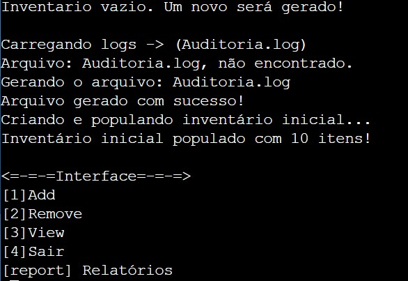
> Logo, ambos os arquivos são criados na memória.

2. 3 itens são adicionados.
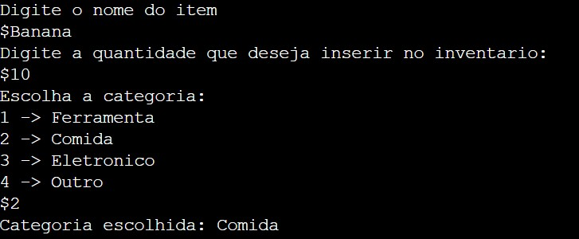
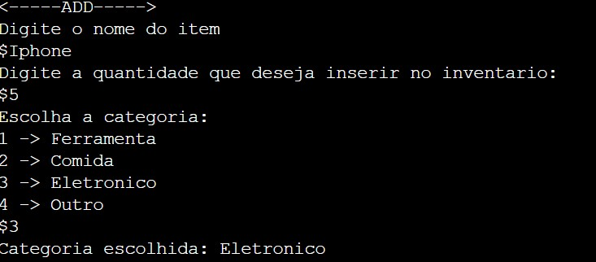
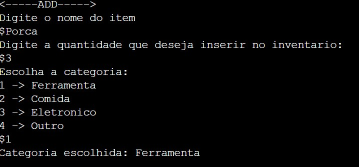
> Programa é fechado e o arquivo Inventario e Auditoria é armazenado com os respectivos itens.

4. 3 últimas linhas contendo os 3 históricos de adição de item na Auditoria.log, juntamente com a criação do arquivo Auditoria.log e Inventario.log
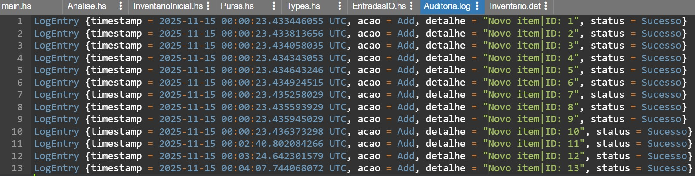

5. 3 últimas linhas contendo os 3 históricos de adição de item.
>("11",Item {itemID = "11", nome = "banana", quantidade = 10, categoria = Comida})

>("12",Item {itemID = "12", nome = "iphone", quantidade = 5, categoria = Eletronico})

>("13",Item {itemID = "13", nome = "porca", quantidade = 3, categoria = Ferramenta})

6. Listagem dos itens em memória.

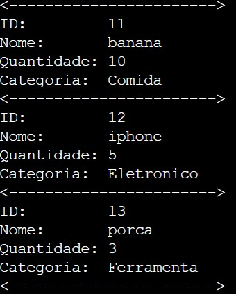

### Cenário 2: Erro de Lógica (Estoque Insuficiente)

1. Adicionando um item com 10 unidades.

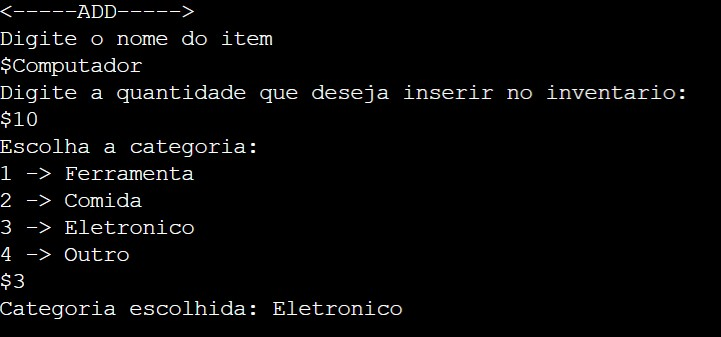

2. Removendo 15 unidades desse item.

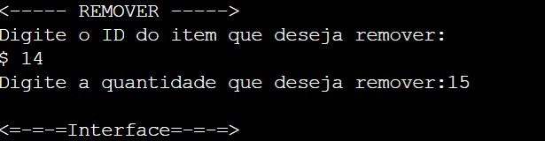

3. Listando com 10 unidades o computador ainda, porquanto o erro ocorreu.

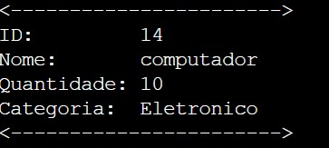

4. Exibição da falha no logEntry do computador, o qual possui o id 14.

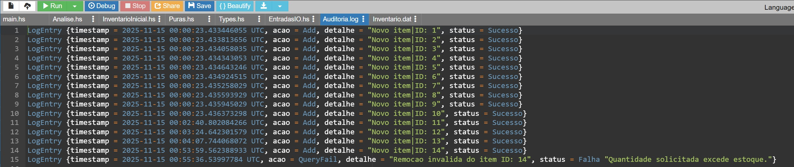

### Cenário 3: Geração de Relatório de Erros

1. Exibição do relatório com o log de erro.

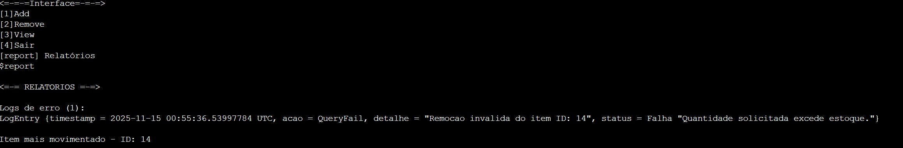